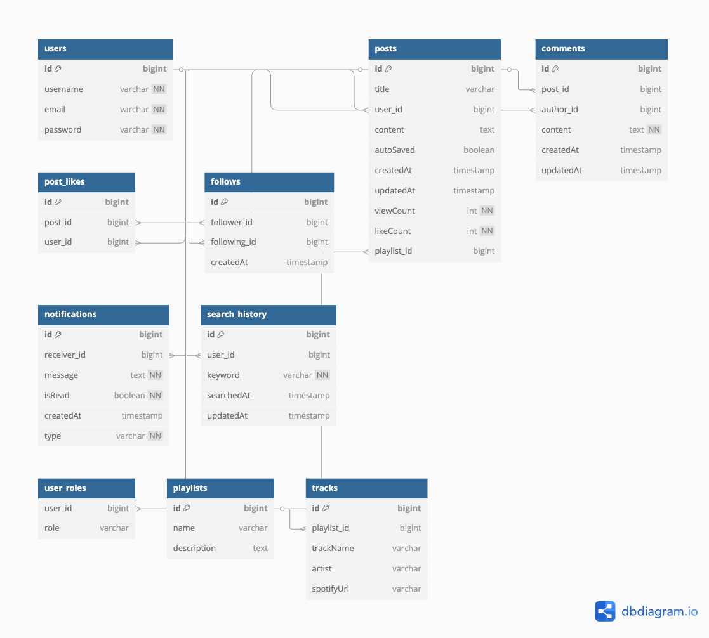

# MoodLogBe

감정 분석 기반 AI 플레이리스트 추천 기능을 갖춘 블로그 백엔드입니다.

---

## 🚀 주요 기능

- **회원가입 / 로그인 / 로그아웃**: JWT 기반 인증
- **게시글 CRUD**: 작성, 조회, 수정, 삭제, 좋아요
- **댓글**: 작성, 조회, 삭제
- **AI 감정 분석**: FastAPI와 연동하여 텍스트 기반 감정 분석 및 추천 음악 제공
- **팔로우**: 이웃 추가/제거, 목록 조회
- **알림**: 댓글/좋아요/팔로우 알림
- **검색**: 게시글 및 사용자 검색, 히스토리 관리
- **Spotify 연동**: 플레이리스트 추천

---

## ⚙️ 기술 스택

- **Java 17**
- **Spring Boot 3**
- **MySQL**, **Redis**
- **WebClient** (AI FastAPI 서버 연동)
- **JWT 기반 인증**
- **JPA & Hibernate**
- **Gradle 빌드**

---

## 📁 주요 폴더 구조
```
📦java
┗ 📂com
┃ ┗ 📂DevStream
┃ ┃ ┗ 📂MoodLogBe
┃ ┃ ┃ ┣ 📂auth
┃ ┃ ┃ ┣ 📂comment
┃ ┃ ┃ ┣ 📂config
┃ ┃ ┃ ┣ 📂notification
┃ ┃ ┃ ┣ 📂post
┃ ┃ ┃ ┣ 📂recommendation
┃ ┃ ┃ ┣ 📂search
┃ ┃ ┃ ┣ 📂social
┃ ┃ ┃ ┣ 📂spotify
┃ ┃ ┃ ┗ 📜MoodLogBeApplication.java
```

## 🗂️ 디렉토리 상세
### 📂 auth : 사용자 인증 및 회원 관리
  controller, domain, dto, filter, repository, service, util

### 📂 comment : 게시글의 댓글 작성, 조회 가능
  controller, domain, dto, repository, service

### 📂 config : 프로젝트 전반의 설정 (시큐리티, 예외처리 등)

### 📂 notification : 알림 관리(댓글, 팔로우, 좋아요 알림 등)
  controller, domain, dto, repository, service

### 📂 post : 게시글 CRUD, 좋아요 관리 및 사용자별 게시글 조회
  controller, domain, dto, repository, service

### 📂 recommendation : 감정 분석 결과 기반으로 AI 음악 추천 기능(FastAPI 연동 부분) 
  controller, dto, service

### 📂 search : 게시글 및 사용자 검색, 검색 기록 저장 기능
  controller, domain, dto, repository, service

### 📂 social : 팔로우/언팔로우, 이웃(친구) 관리
  controller, domain, dto, mapper, repository, service

### 📂 spotify : Spotify API 토큰 발급 및 인증
  controller, dto, service

## 📊 ERD 다이어그램

아래는 전체 DB 관계도를 나타낸 ERD입니다.




## 📚 API 명세서

자세한 API 사용법은 [API_SPEC](./API_SPEC.md)에 있습니다.


## 👥 참여 개발자
| 이름  | 소속          | 역할              |
| --- |-------------|-----------------|
| 남하원 | 컴퓨터공학전공 2학년 | 팀장/기획/백엔드 개발    |
| 이신비 | 컴퓨터공학전공 2학년 | UI & UX 디자인/AI 개발 |
| 김승주 | 컴퓨터공학전공 2학년 | 프론트엔드 개발        |
| 박주환 | 컴퓨터공학전공 2학년 | 프론트엔드 개발        |
