# MoodLog - 감정 기반 음악 공유 플랫폼

MoodLog는 사용자의 감정을 분석하여 그에 맞는 음악 플레이리스트를 자동으로 생성하고, 이를 다른 사용자들과 공유할 수 있는 소셜 플랫폼입니다.

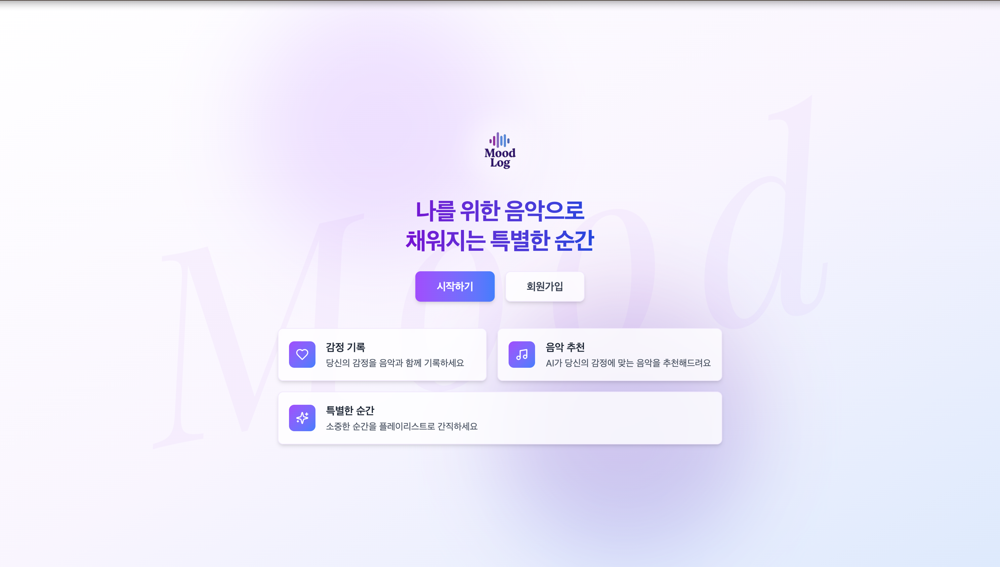

## 📌 주요 기능

### 1. 회원가입/로그인
- 이메일 기반 회원가입
- JWT 토큰 기반 인증
- 소셜 로그인 (예정)
- 사용자 프로필 관리

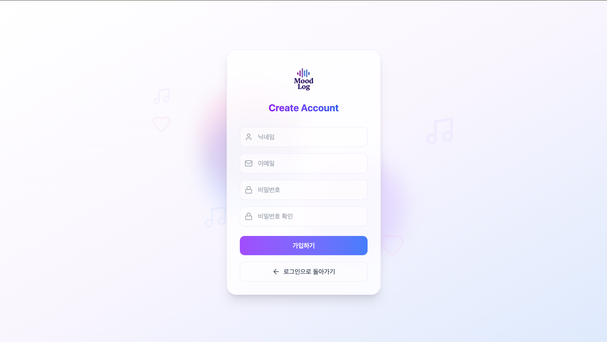
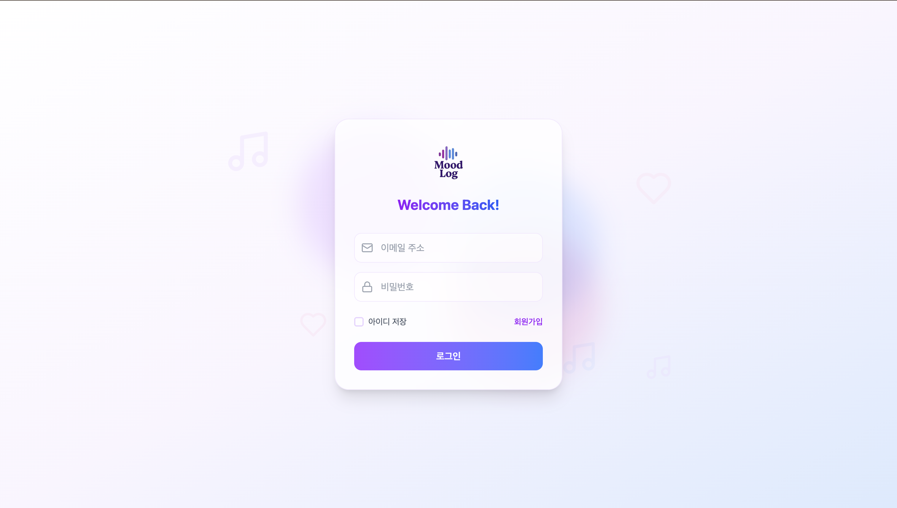

### 2. 메인 페이지
- 인기 게시글 및 최신 게시글 피드
- 팔로우한 사용자의 게시글 모아보기
- 실시간 알림 확인
- 사용자 모달
- 빠른 게시글 작성 버튼

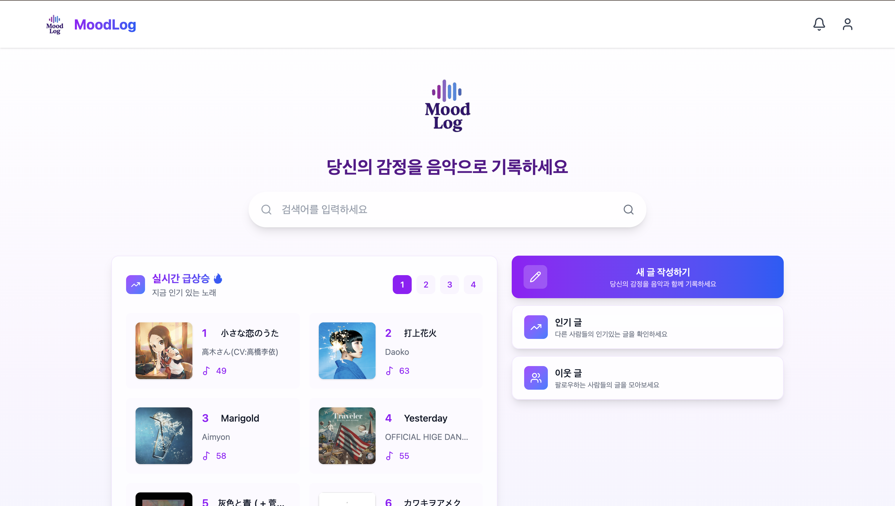
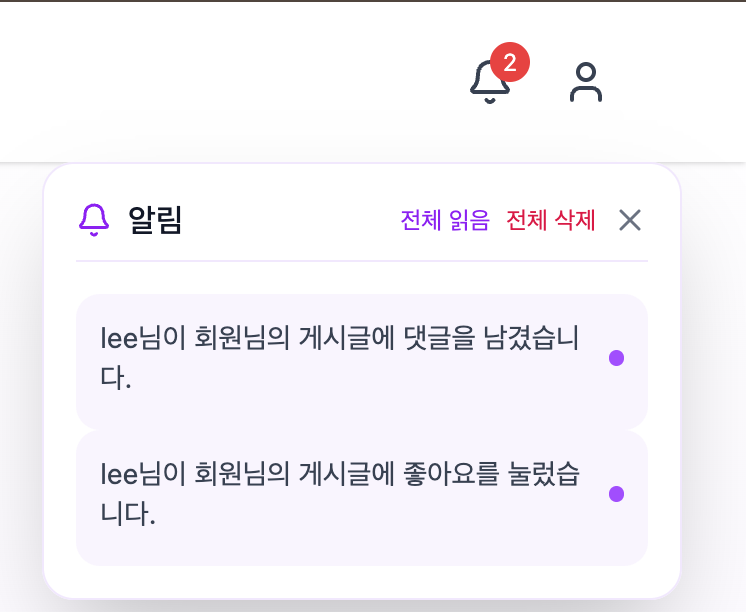
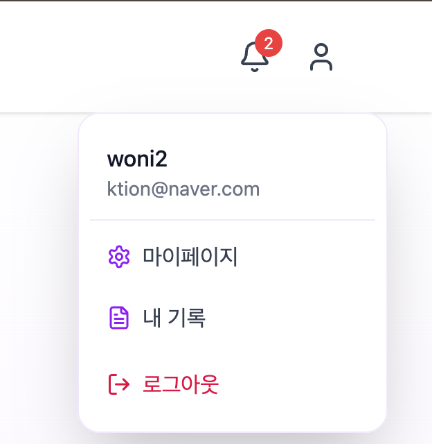
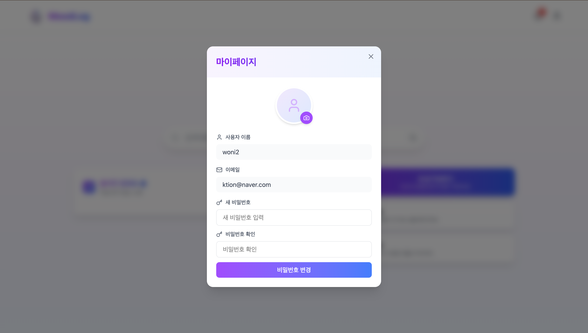

### 3. 감정 기반 게시글 작성
- 사용자의 게시글 내용을 분석하여 감정을 파악
- 파악된 감정에 기반한 맞춤형 플레이리스트 자동 생성
- Spotify API를 활용한 음악 추천 시스템

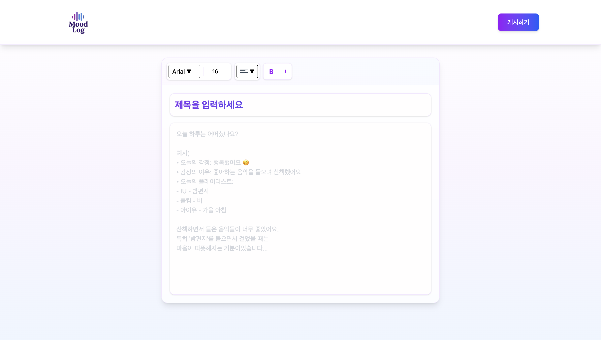

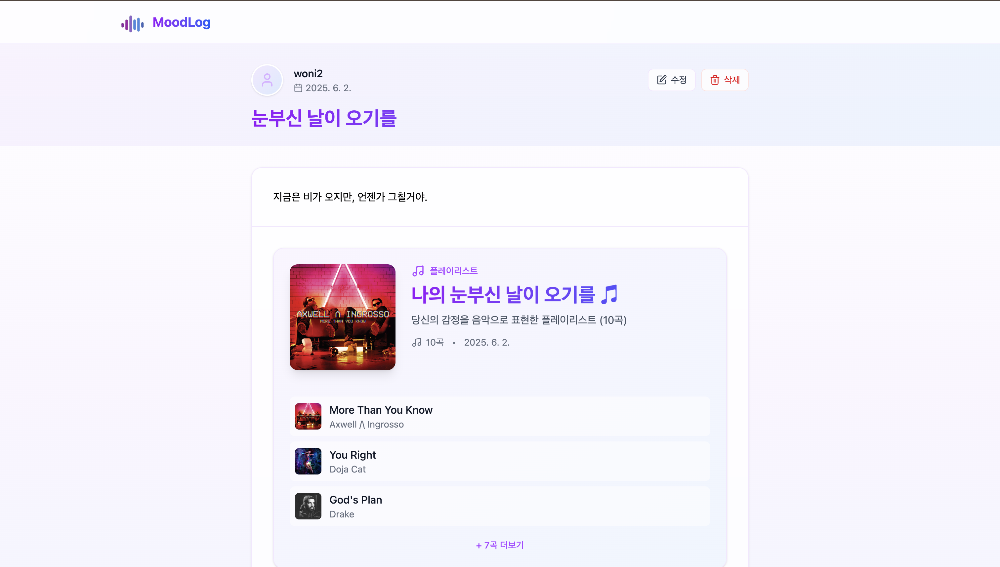
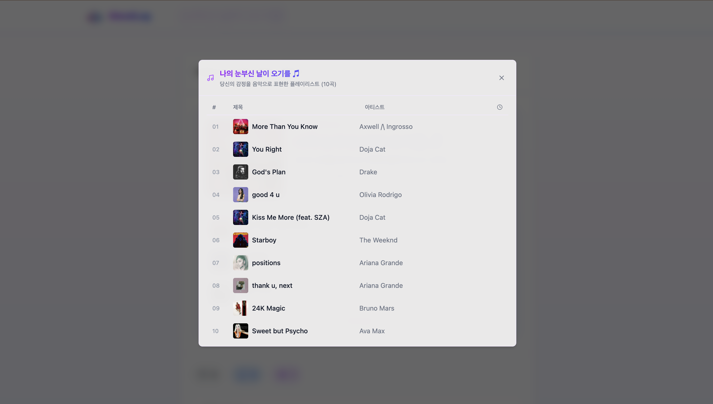
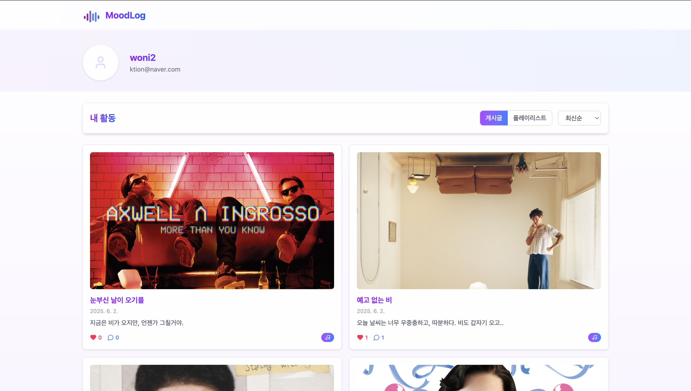
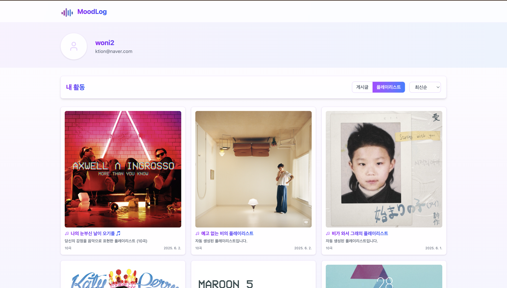
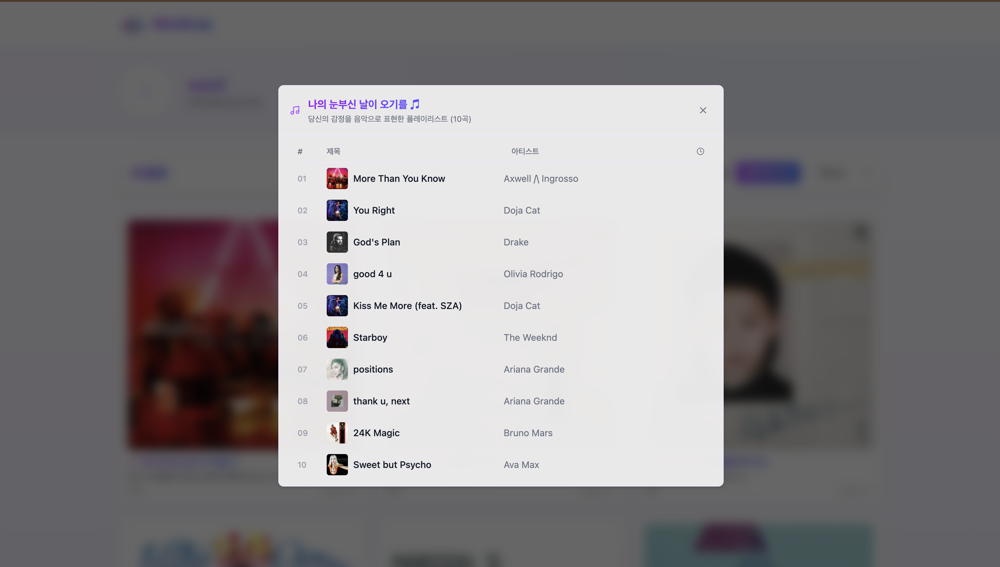

### 4. 인기 게시글 조회
- 최신순, 좋아요 많은 순, 댓글 많은 순으로 정렬 가능 
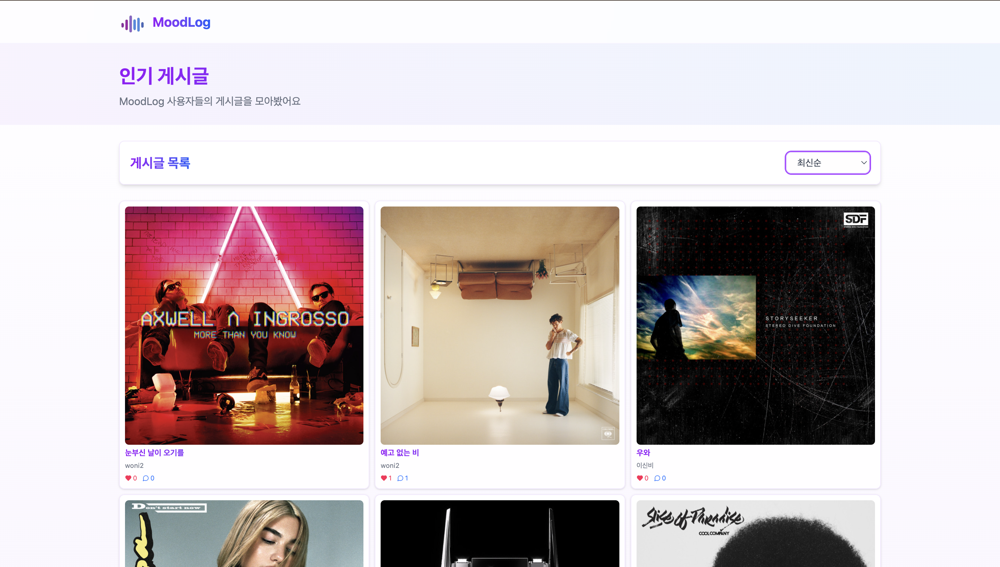

### 5. 소셜 기능
- 사용자 팔로우/팔로잉
- 게시글 좋아요 및 댓글

### 6. 검색 및 탐색
- 통합 검색 (게시글, 사용자)
- 연관 검색어 추천
- 검색 기록 관리

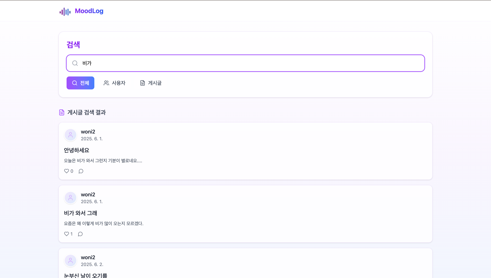

## 🛠 기술 스택

### Frontend
- React
- TypeScript
- Tailwind CSS
- Vite
- Axios

### Backend
- Spring Boot
- Spring Security
- JPA/Hibernate
- MySQL
- JWT Authentication

### AI/ML
- FastAPI
- Spotify API

## 👥 팀 소개
한국외국어대학교 컴퓨터공학부 2학년 재학생
오픈소스SW : 25-1학기 팀 프로젝트
| 이름  | 소속          | 역할              |
| --- |-------------|-----------------|
| 남하원 | 컴퓨터공학전공 2학년 | 팀장/기획/UI & UX 디자인/백엔드 개발    |
| 이신비 | 컴퓨터공학전공 2학년 | UI & UX 디자인/AI 개발 |
| 김승주 | 컴퓨터공학전공 2학년 | 프론트엔드 개발        |
| 박주환 | 컴퓨터공학전공 2학년 | 프론트엔드 개발        |
